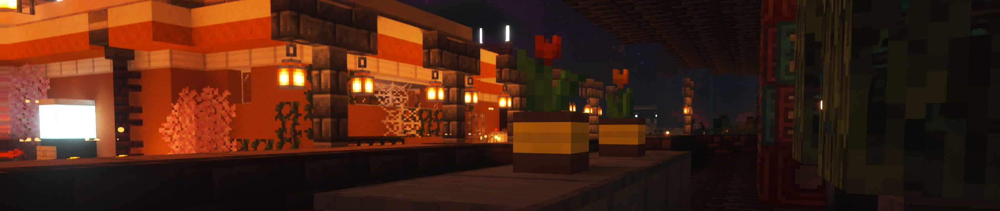

<h3>
  「喵。」&nbsp;
  
</h3>

 

<table width="100%" cellpadding="0" cellspacing="0">
  <tr>
    <td align="left" valign="top">
      <strong>Proficient</strong>
        
      
    </td>
    <td align="left" valign="top">
      <strong>Familiar With</strong>
        
      
    </td>
  </tr>
</table>

  Some of my projects may be in the organization, so keep an eye out for them.

  Some of my projects are previous works and are not easy to read, so please don't check them out if you mind!

  

